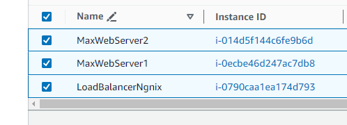
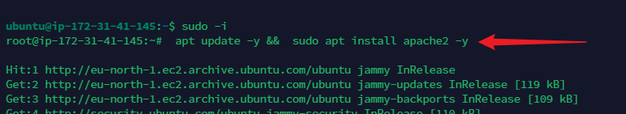
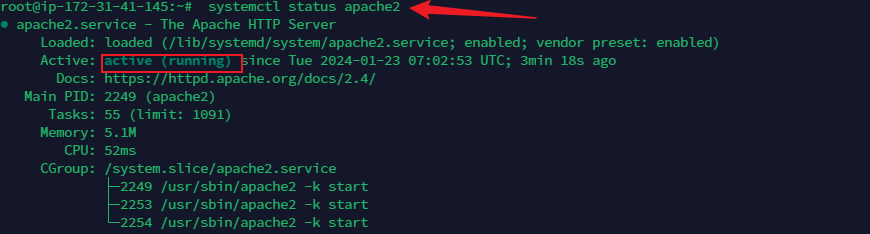
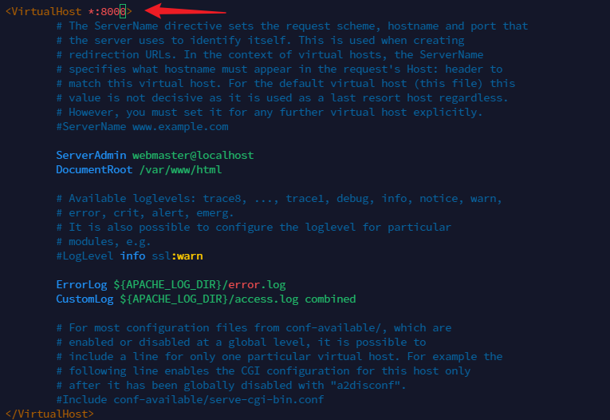
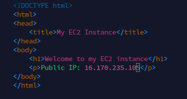
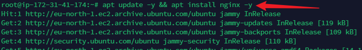
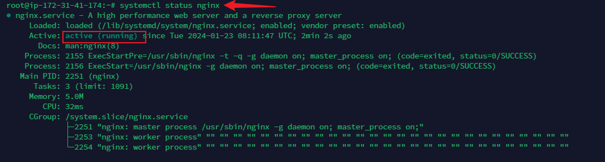
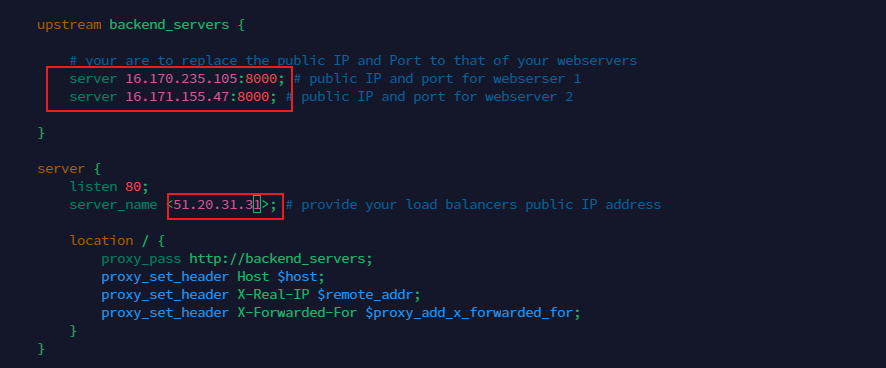
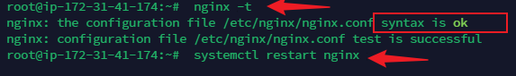
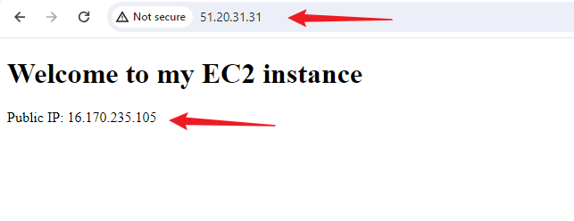

#Implementing Load Balancers With Nginx

## Introduction
Load Balancing helps to distribute traffic efficiently across multiple servers, optimize performance, ensure high availabiltiy for web application. This helps to keep everything running smoothly and ensures that websites and apps work quickly and don't get too slow.

The load balancer stands in front of the webservers, all traffic gets to it first, it then distibutes the traffic across the set of webservers.

For this project we would use Nginx, which is a versatile software. it can act like a webserver, reverse proxy, a load balancer etc.Nginx would be configured to work as a load balancer

STEPS:
- First, two EC2 instances running ubuntu 22.04 would be provisioned and apache webserver would be installed on them.
- Port 8000  would be opened on the webserver to allow traffic from anywhere
- The default pages of the wevservers would updated to display their public IP addresses

1. Provisioning EC2.
Three EC2 instance was launched as shown in the image below:
-  MaxWebServer1 and MaxWebServer2  are the websevers
- LoadBalancerNgnix  would act as the load balancer

2. Port 8000 was opened for the webservers MaxWebServer1 and MaxWebServer2. This would ensure that traffic would be allowed from anywhere. The Load balancer(LoadBalancerNgnix) would run on 80. To do this we added a rule t the security group of each of the Webservers

3.Install Apache Webserver:
apache software would be installed on MaxWebServer1 and MaxWebServer2 webservers.

- Syntax: sudo apt update -y &&  sudo apt install apache2 -y

- Verify that apache is running: sudo systemctl status apache2

4. Configure Apache to server a page showing its public IP

First, The Apache webserver would be configured to serve content on port 8000 instead of its default port 80

- We would edit *sudo vi /etc/apache2/ports.conf* using a vi editor, by adding a new Listen directive for port 8000

- It would also edit *sudo vi /etc/apache2/sites-available/000-default.conf* and change port 80 on the virtualhost to 8000

- Restart apache to reload the new configuration:

syntax: sudo systemctl restart apache2

5. Creating a new html for each of the webservers

A new html file is created to display the public IP of each of the webservers

- The file ownership of the index.html file is changed with the syntax: *sudo chown www-data:www-data ./index.html*

- Overriding the default html file of Apache Webserver: The default html file is replaced with our new html file with syntax: *sudo cp -f ./index.html /var/www/html/index.html*

- To load the use configuration we use the command below *sudo systemctl restart apache2*

- Below is the webpage(index.html) from one of the webserver

6. Configuring Nginx as a Load Balancer

At the beginning of this project with provisioned a new EC2 instance for the load balancer name *LoadBalancerNgnix* and also opened port 80 to accept traffic from anywhere.

- Next we install Nginx into the instance using the syntax: *sudo apt update -y && sudo apt install nginx -y* 

- Verify Nginx is installed. 
Syntax: *sudo systemctl status nginx*

- Open Nginx configuration file and change the server IP address to the public IP of the webservers that was created

- *sudo vi /etc/nginx/conf.d/loadbalancer.conf*

.

From the image, the upstream backend_servers defines a group of backend servers. The server lines the upstream block list the addresses and port of the backend servers. The proxy_pass inside the location block sets up the load balancing, passing the request to the backend servers. The proxy_set_header lines pass necessary headers to the backend servers to correctly handle the requests.

- Test the configuration and restart nginx:

To test configuration: syntax-sudo nginx -t

To restart nginx- sudo systemctl restart nginx

.

- To ensure our new configuration works we need to disable default host and then reload Nginx to apply changes using the command below respectively

- Syntax: sudo unlink /etc/nginx/sites-enabled/default

-Syntax:$ sudo systemctl reload nginx

.

- The  public IP address of the Nginx is pasted on the browser and same webpages displayed by each of the webservers (MaxWebserver1) and MaxWebServer2 is served as shown in the image below:

 

  
